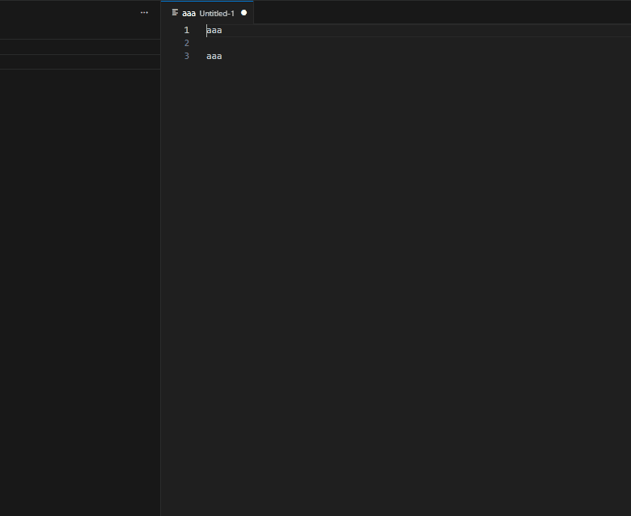
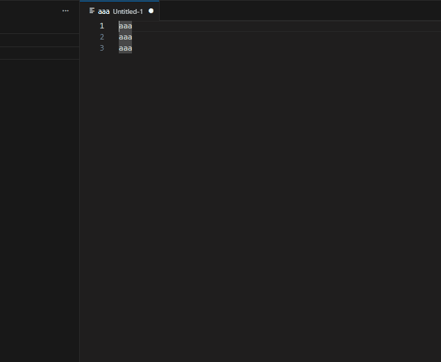

# nangman-text-wrap

## Cheatsheet
| command                                               | return                         |
| :---------------------------------------------------- | :----------------------------- |
| text-wrap-noselections-notrailing-quotes-double-comma | `ㅣ"ㅇㅇ", "ㅇㅇ", ... "ㅇㅇ"` |

## Specification
| command                                                 | return                                 |
| :------------------------------------------------------ | :------------------------------------- |
| text-wrap-quotes-double                                 | ``"ㅇㅇ"``                             |
| text-wrap-quotes-double-comma                           | ``"ㅇㅇ",``                            |
| text-wrap-quotes-single                                 | ``'ㅇㅇ'``                             |
| text-wrap-quotes-single-comma                           | ``'ㅇㅇ',``                            |
| text-wrap-backtick                                      | `` `ㅇㅇ` ``                           |
| text-wrap-backtick-comma                                | `` `ㅇㅇ`, ``                          |
| text-wrap-brackets-round                                | ``(ㅇㅇ)``                             |
| text-wrap-brackets-round-comma                          | ``(ㅇㅇ),``                            |
| text-wrap-brackets-square                               | ``[ㅇㅇ]``                             |
| text-wrap-brackets-square-comma                         | ``[ㅇㅇ],``                            |
| text-wrap-brackets-curly                                | ``{ㅇㅇ}``                             |
| text-wrap-brackets-curly-comma                          | ``{ㅇㅇ},``                            |
| text-wrap-brackets-angle                                | ``<ㅇㅇ>``                             |
| text-wrap-brackets-angle-comma                          | ``<ㅇㅇ>,``                            |
| text-wrap-notrailing-quotes-double-comma                | ``"ㅇㅇ", "ㅇㅇ", ... "ㅇㅇ"``         |
| text-wrap-notrailing-quotes-single-comma                | ``'ㅇㅇ', 'ㅇㅇ', ... 'ㅇㅇ'``         |
| text-wrap-notrailing-backtick-comma                     | `` `ㅇㅇ`, `ㅇㅇ`, ... `ㅇㅇ` ``       |
| text-wrap-notrailing-brackets-round-comma               | ``(ㅇㅇ), (ㅇㅇ), ... (ㅇㅇ)``         |
| text-wrap-notrailing-brackets-square-comma              | ``[ㅇㅇ], [ㅇㅇ], ... [ㅇㅇ]``         |
| text-wrap-notrailing-brackets-curly-comma               | ``{ㅇㅇ}, {ㅇㅇ}, ... {ㅇㅇ}``         |
| text-wrap-notrailing-brackets-angle-comma               | ``<ㅇㅇ>, <ㅇㅇ>, ... <ㅇㅇ>``         |
| text-wrap-input                                         | `🔴ㅇㅇ🟠`                           |
| text-wrap-input-notrailing                              | `🔴ㅇㅇ🟠 🔴ㅇㅇ🟠 ... 🔴ㅇㅇ🟡` |
| text-wrap-noselections-quotes-double                    | ``ㅣ"ㅇㅇ"``                           |
| text-wrap-noselections-quotes-double-comma              | ``ㅣ"ㅇㅇ",``                          |
| text-wrap-noselections-quotes-single                    | ``ㅣ'ㅇㅇ'``                           |
| text-wrap-noselections-quotes-single-comma              | ``ㅣ'ㅇㅇ',``                          |
| text-wrap-noselections-backtick                         | ``ㅣ `ㅇㅇ` ``                         |
| text-wrap-noselections-backtick-comma                   | ``ㅣ `ㅇㅇ`, ``                        |
| text-wrap-noselections-brackets-round                   | ``ㅣ(ㅇㅇ)``                           |
| text-wrap-noselections-brackets-round-comma             | ``ㅣ(ㅇㅇ),``                          |
| text-wrap-noselections-brackets-square                  | ``ㅣ[ㅇㅇ]``                           |
| text-wrap-noselections-brackets-square-comma            | ``ㅣ[ㅇㅇ],``                          |
| text-wrap-noselections-brackets-curly                   | ``ㅣ{ㅇㅇ}``                           |
| text-wrap-noselections-brackets-curly-comma             | ``ㅣ{ㅇㅇ},``                          |
| text-wrap-noselections-brackets-angle                   | ``ㅣ<ㅇㅇ>``                           |
| text-wrap-noselections-brackets-angle-comma             | ``ㅣ<ㅇㅇ>,``                          |
| text-wrap-noselections-notrailing-quotes-double-comma   | ``ㅣ"ㅇㅇ", "ㅇㅇ", ... "ㅇㅇ"``       |
| text-wrap-noselections-notrailing-quotes-single-comma   | ``ㅣ'ㅇㅇ', 'ㅇㅇ', ... 'ㅇㅇ'``       |
| text-wrap-noselections-notrailing-backtick-comma        | ``ㅣ `ㅇㅇ`, `ㅇㅇ`, ... `ㅇㅇ` ``     |
| text-wrap-noselections-notrailing-brackets-round-comma  | ``ㅣ(ㅇㅇ), (ㅇㅇ), ... (ㅇㅇ)``       |
| text-wrap-noselections-notrailing-brackets-square-comma | ``ㅣ[ㅇㅇ], [ㅇㅇ], ... [ㅇㅇ]``       |
| text-wrap-noselections-notrailing-brackets-curly-comma  | ``ㅣ{ㅇㅇ}, {ㅇㅇ}, ... {ㅇㅇ}``       |
| text-wrap-noselections-notrailing-brackets-angle-comma  | ``ㅣ<ㅇㅇ>, <ㅇㅇ>, ... <ㅇㅇ>``       |

## Demo
| command                | demo                                          |
| :--------------------- | :-------------------------------------------- |
| text-wrap              |               |
| text-wrap-noselections |  |

## License
This project is licensed under the GPL-3.0 License - see the [LICENSE](LICENSE) file for details.
